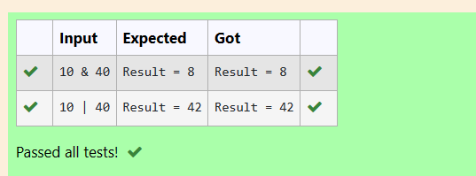
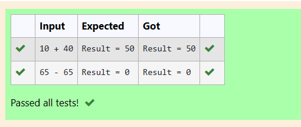

# EX1(d) Conditional Statements(L2)
Developed by: ARSHITHA MS

Register number: 212223240015
 ## AIM:
 To write a C Program to simulate the bitwise operators(&, | ) and arithmetic operators (+,-) using the switch statement.
 ## ALGORITHM:
 1.Start the program

 2.Declare the variables

 3.Get input from the user.

 4.Use the switch case logic
 
 5.Use the operators to perform the required operations

 6.Print the output.
 ## PROGRAM
 ### Program 1:
 ```
#include <stdio.h>
#include<math.h>
int main()
{
    int a,b,c;
    char op;
    scanf("%d %c %d",&a,&op,&b);
    switch (op)
    {
        case '&':
        {
            c = a & b;
            printf( "Result = %d", c);
            break;
        }
        case '|':
        {
            c= a | b;
            printf( "Result = %d", c);
            break;
        }
        default:
        printf("Invalid operator");
        return 0;
    }
    return 0;
}

```
### Program 2:
```
#include<stdio.h> 

int main()
{       
    int a, b, result;
    char op; 
    
    scanf("%d %c %d", &a, &op, &b);

    switch(op)
    {
        case '+':
        {
            result = a + b;
            printf("Result = %d", result);
            break;
        }
        case '-':
        {
            result = a - b;
            printf("Result = %d", result);
            break;
        }
        default : printf("Invalid Input");
        break;
    }
    if(result!='\0')
    
    return 0;
}

```

## OUTPUT:
### Output 1:



### Output 2:

## RESULT:
Thus the program to write a C Program to simulate the bitwise operators(&, | ) and arithmetic operators (+,-) using the switch statement is executed successfully.